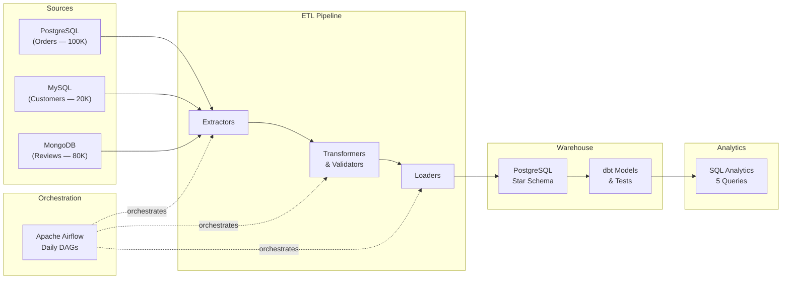
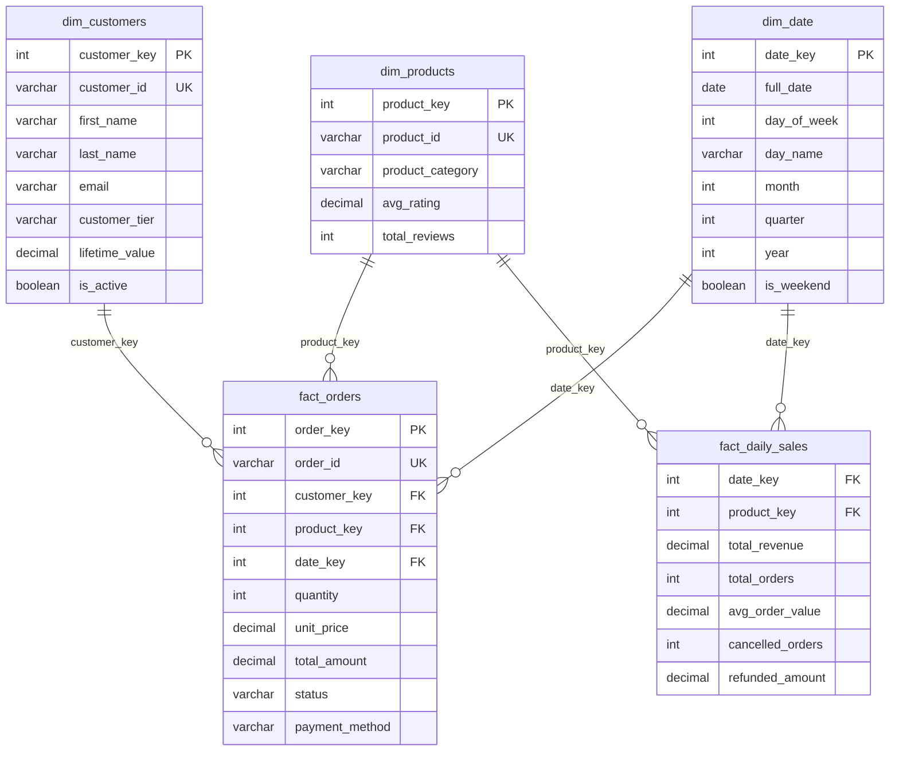

# Multi-Source Data Warehouse & ETL Platform

So, I built this project because I wanted to show how I approach data warehousing from scratch. The idea was simple — pull data from three completely different source systems, clean it up through automated pipelines, and load everything into a star schema so that analytics teams can just run their queries without worrying about data quality issues.

The warehouse handles 200K+ records across PostgreSQL, MySQL, and MongoDB. I used Airflow to orchestrate daily ETL runs and dbt for the data modeling and testing layer so that everything stays consistent and reliable.

---

## How It Works



The whole flow goes like this — three extractors pull data from the source databases in parallel, then the transformer cleans everything up (removes duplicates, handles nulls, checks if the foreign keys actually match), and then the loader pushes it into the star schema warehouse. Airflow runs this entire pipeline daily so that I don't have to trigger anything manually.

---

## Star Schema Design

I went with a star schema because from my experience it's the cleanest way to set up an analytics warehouse. You have your dimension tables on the sides and your fact tables in the center, and everything connects through surrogate keys.



So there are 3 dimension tables (customers, products, date) and 2 fact tables (orders, daily_sales). I also added an `etl_run_log` table so that every pipeline run gets tracked automatically.

---

## Tech Stack

| What              | Tool                    |
|-------------------|-------------------------|
| Orchestration     | Apache Airflow 2.8      |
| Data Modeling     | dbt-core 1.7            |
| Warehouse         | PostgreSQL 15           |
| Source DB 1       | PostgreSQL 15 (orders)  |
| Source DB 2       | MySQL 8.0 (customers)   |
| Source DB 3       | MongoDB 7.0 (reviews)   |
| Language          | Python 3.9+             |
| Data Processing   | Pandas, SQLAlchemy      |
| Infrastructure    | Docker Compose          |
| Testing           | pytest                  |

---

## Project Structure

```
etl-data-warehouse/
├── README.md
├── docker-compose.yml              # 5 containers (3 sources + warehouse + Airflow)
├── requirements.txt
├── .env.example
├── config/
│   └── warehouse_config.yaml       # Record counts, ETL schedule, batch sizes
├── source_databases/
│   ├── postgres_source.py           # Generates 100K order records
│   ├── mysql_source.py              # Generates 20K customer records
│   ├── mongo_source.py              # Generates 80K review documents
│   └── seed_data.py                 # Master seeder — runs all three
├── extractors/
│   ├── postgres_extractor.py        # Full + incremental from PostgreSQL
│   ├── mysql_extractor.py           # Full + incremental from MySQL
│   └── mongo_extractor.py           # Full + incremental from MongoDB
├── transformers/
│   └── data_transformer.py          # 4 cleaning & validation functions
├── loaders/
│   └── warehouse_loader.py          # Upsert dims, bulk-insert facts, date dim
├── warehouse/
│   ├── target_schema.sql            # Star schema DDL (3 dims + 2 facts + audit)
│   └── analytics_queries.sql        # 5 SQL queries with CTEs & window functions
├── airflow/
│   └── dags/
│       ├── etl_daily_pipeline.py    # 9-task daily ETL DAG
│       └── data_quality_check.py    # Quality monitoring DAG
├── dbt_warehouse/
│   ├── dbt_project.yml
│   ├── profiles.yml
│   ├── models/
│   │   ├── staging/                 # 4 staging views
│   │   ├── marts/                   # 4 mart tables
│   │   └── schema.yml              # Column tests (unique, not_null)
│   └── tests/                       # 2 custom data quality tests
└── tests/
    ├── test_extractors.py           # Extractor unit tests
    ├── test_transformers.py         # Transformer unit tests (15+ cases)
    └── test_pipeline.py             # Integration tests
```

---

## Prerequisites

You need Docker and Docker Compose installed on your machine, and Python 3.9+. If you want to run dbt separately, you'll also need the dbt CLI (`pip install dbt-core dbt-postgres`).

---

## Quick Start

To get this running, we need to do a few things here: starting the containers, installing dependencies, and then seeding the source databases with sample data.

```bash
# Clone the repo
git clone https://github.com/Ch-Suharsha/etl-data-warehouse.git
cd etl-data-warehouse

# Start all services (3 source DBs + warehouse + Airflow)
docker-compose up -d

# Install Python dependencies
pip install -r requirements.txt

# Seed source databases with sample data (200K+ records)
python -m source_databases.seed_data

# Access Airflow at http://localhost:8080 (admin / admin)
# You can trigger the ETL pipeline from there

# Run dbt models and tests
cd dbt_warehouse && dbt run && dbt test
```

---

## ETL Pipeline — What Each Stage Does

The pipeline runs daily and I set it up so that each stage feeds into the next one.

The first thing that happens is the extraction. Three extractors pull data in parallel — PostgreSQL gives us 100K order records, MySQL gives us 20K customer records, and MongoDB gives us 80K product review documents. I built both full and incremental extraction so that after the initial load we're only pulling new data.

Next, the transformer kicks in. It removes duplicates, handles null values, standardizes formats (like making all status values uppercase), and adds some derived columns like account age and sentiment category. The big thing here is the referential integrity check — it makes sure that every customer_id in the orders table actually exists in the customers table so that we don't end up with orphaned records in the warehouse.

Now, the loader takes the cleaned data and pushes it into the star schema. Dimensions use an upsert pattern (ON CONFLICT DO UPDATE) so that existing records get updated instead of duplicated. Facts use a bulk-insert with ON CONFLICT DO NOTHING so that we skip any duplicates.

After that, dbt runs its staging views and mart materializations, and then the dbt tests check for things like unique keys, not-null constraints, positive amounts, and valid dates.

Finally, the whole run gets logged into the `etl_run_log` table so that I can track how many records were extracted, transformed, loaded, and rejected in each run.

---

## SQL Analytics

I wrote 5 analytical queries that use CTEs and window functions to pull insights from the warehouse. Here are a couple of examples.

**Monthly Revenue with Running Total** — This one uses LAG() to get month-over-month change and SUM() OVER to build a running cumulative total.

```sql
WITH monthly_revenue AS (
    SELECT d.year, d.month, SUM(f.total_amount) AS revenue
    FROM fact_orders f
    JOIN dim_date d ON f.date_key = d.date_key
    WHERE f.status = 'COMPLETED'
    GROUP BY d.year, d.month
)
SELECT year, month, revenue,
    LAG(revenue) OVER (ORDER BY year, month) AS prev_month,
    SUM(revenue) OVER (ORDER BY year, month) AS running_total
FROM monthly_revenue;
```

**Daily Anomaly Detection** — This uses a 7-day moving average and standard deviation to flag days where revenue is way off from the norm.

```sql
WITH daily AS (
    SELECT d.full_date, SUM(f.total_amount) AS daily_total
    FROM fact_orders f JOIN dim_date d ON f.date_key = d.date_key
    GROUP BY d.full_date
)
SELECT full_date, daily_total,
    AVG(daily_total) OVER (ORDER BY full_date ROWS 7 PRECEDING) AS ma_7d,
    CASE WHEN ABS(daily_total - AVG(daily_total) OVER (ORDER BY full_date ROWS 7 PRECEDING))
         > 2 * STDDEV(daily_total) OVER (ORDER BY full_date ROWS 7 PRECEDING)
    THEN 'ANOMALY' ELSE 'NORMAL' END AS flag
FROM daily;
```

All 5 queries are in [`analytics_queries.sql`](warehouse/analytics_queries.sql). The other three cover customer tier analysis with NTILE(), product category ranking with RANK(), and a customer retention cohort analysis.

---

## Data Quality

I set up quality checks at multiple levels so that bad data doesn't make it into the final tables.

The transformer catches things like duplicates, null values, and broken foreign key references before anything gets loaded. Then dbt runs built-in tests for unique and not_null on all the key columns, plus I wrote two custom tests — one that checks for negative order amounts and another that flags orders with invalid date keys.

On top of that, there's a separate Airflow DAG that runs daily after the main ETL. It checks null rates across all columns, looks for duplicates in the key tables, and validates that all the foreign key relationships in the fact tables actually point to existing dimension records. Everything gets logged to the `etl_run_log` table so that I can see if something went wrong.

---

## Running Tests

```bash
# Run all unit and integration tests
python -m pytest tests/ -v

# Run dbt tests
cd dbt_warehouse && dbt test
```

---

And that's the whole project. I built everything from the ground up — the source data generation, the ETL pipeline, the star schema, the dbt models, and the analytics layer. Feel free to reach out if you have any questions or suggestions.

---

## License

MIT
